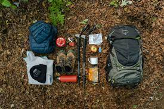
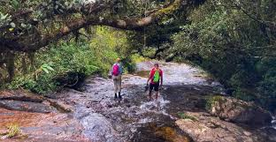
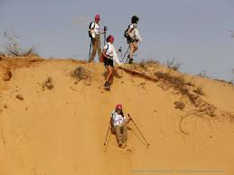

# Livre de Randonnée

## Introduction

Bienvenue dans notre livre de randonnée, où nous explorons des sentiers pittoresques et des paysages magnifiques. Que vous soyez un randonneur débutant ou expérimenté, ces itinéraires vous offriront une expérience inoubliable en pleine nature.

## Chapitre 1: Les Essentiels de la Randonnée

Avant de partir à l'aventure, assurez-vous d'avoir les essentiels de la randonnée. Voici une liste de ce que vous devriez emporter :

- Sac à dos
- Chaussures de randonnée
- Vêtements appropriés selon la météo
- Nourriture et collations
- Eau en quantité suffisante
- Carte et boussole
- Trousse de premiers soins

## Chapitre 2: Sentier des Montagnes Majestueuses

Découvrez le Sentier des Montagnes Majestueuses, une aventure panoramique à travers des sommets époustouflants et des vallées verdoyantes.

### Itinéraire

1. Départ du parking de la vallée.
2. Ascension progressive vers les crêtes.
3. Pause déjeuner avec vue panoramique.
4. Descente à travers les forêts denses.
5. Retour au point de départ.

## Chapitre 3: Randonnée le Long du Ruisseau Sérénité

Explorez la tranquillité du Ruisseau Sérénité avec ses eaux cristallines et sa faune abondante.

### Itinéraire

1. Départ du point d'accès au ruisseau.
2. Suivez le sentier le long du cours d'eau.
3. Observations d'oiseaux près du ruisseau.
4. Pause pique-nique au bord de l'eau.
5. Retour en longeant une forêt ombragée.

## Chapitre 4: Traversée du Désert Doré

Préparez-vous pour une aventure unique à travers le Désert Doré, où les dunes de sable scintillent sous le soleil.

### Itinéraire

1. Départ du poste de contrôle du désert.
2. Ascension des dunes de sable doré.
3. Exploration des formations rocheuses uniques.
4. Coucher de soleil magique sur le désert.
5. Retour au poste de contrôle.

## Conclusion

Que vous choisissiez les montagnes, les ruisseaux, ou les déserts, chaque randonnée offre une aventure unique. Profitez de la nature, respectez l'environnement et partagez vos expériences avec d'autres passionnés de randonnée.

Bonne exploration !

